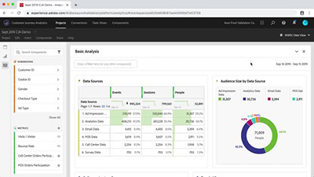

# Aperçu

Bienvenue sur le site Tutorials [!DNL Customer Journey Analytics].  L&#39;utilisation de ces didacticiels ainsi que de la [documentation](https://docs.adobe.com/content/help/fr-FR/analytics-platform/using/cja-landing.html) vous permettra de mieux comprendre comment utiliser Adobe Analytics pour obtenir plus rapidement que jamais des informations client sur plusieurs canaux.  Pour démarrer,

* Consultez la section **&quot;Nouveautés&quot;** ci-dessous pour consulter les dernières nouveautés
* **Le personnel** de Pickshlight met en évidence certains de nos contenus préférés
* Explorez le contenu par rubrique et sous-rubrique dans le **volet de navigation de gauche**
* Utilisez le champ **search** en haut de la page si vous savez ce que vous recherchez

Customer Journey Analytics vous permet de contrôler la manière dont vous connectez vos données en ligne et hors ligne dans Analysis Workspace sur n’importe quel ID de client commun, ce qui vous permet enfin d’effectuer une attribution, une segmentation, un flux, un abandon, etc. dans l’ensemble de vos données client.

## Nouveautés

* **[Déplacer les segments Adobe Analytics vers le Customer Journey Analytics (vidéo)](/help/moving-adobe-analytics-segments-to-customer-journey-analytics.md)**

   *Découvrez des conseils sur la recréation de vos segments Adobe Analytics dans le Customer Journey Analytics*

* **[Déplacer les mesures calculées d’Adobe Analytics vers Customer Journey Analytics (vidéo)](/help/moving-your-calculated-metrics-from-adobe-analytics-to-customer-journey-analytics.md)**

   *Découvrez des conseils pour recréer vos mesures calculées Adobe Analytics dans le Customer Journey Analytics*

* **[Création de Filtres entre Canaux (vidéo)](/help/creating-cross-channel-filters-in-customer-journey-analytics.md)**

   *Créer des filtres dans un Customer Journey Analytics qui utilisent plusieurs sources de données et plusieurs canaux*

## Sélection du personnel

<table>
<tr>
  <td>
    
    

      <a href="/help/understanding-how-customer-journey-analytics-uses-identity.md">
    <strong>Comprendre comment le Customer Journey Analytics utilise l'identité</strong>
    </a>
    

    

    <em>Un aperçu pratique de la façon dont l'identité affecte votre analyse en Customer Journey Analytics</em>
    

  </td>
   <td>
    
    

      <a href="/help/architecture-and-integrations-of-cja.md">
    <strong>Architecture et intégrations des Customer Journey Analytics</strong>
    </a>
    

    

    <em>Présentation de l'architecture du Customer Journey Analytics, y compris l'intégration au Adobe Experience Platform.</em>
    

  </td>
  <td>
    
    

      <a href="/help/cross-channel-attribution-in-customer-journey-analytics.md">
    <strong>Attribution entre Canaux dans le Customer Journey Analytics</strong>
    </a>
    

    

    <em>Utilisation des visualisations pour afficher l’attribution (attribuer du crédit) sur plusieurs canaux.</em>
    

  </td>
</tr>
</table>
